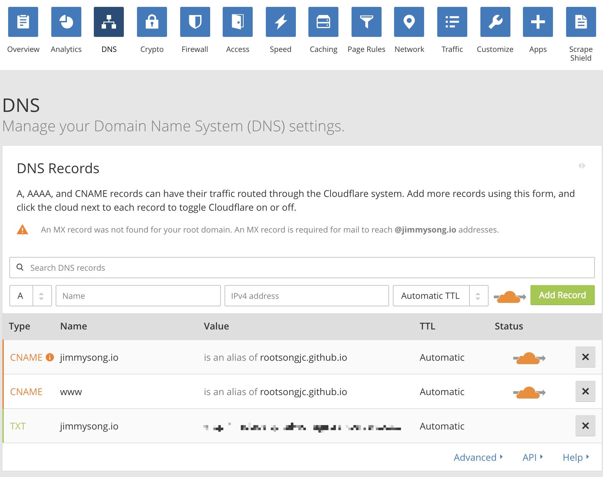

# 配置DNS解析

为了让用户访问域名能够解析到我们申请的GitHub Pages上，需要为GitHub Pages设置CNAME，同时再将我们申请的域名解析到GitHub Pages上。

## 设置CNAME

在GitHub Pages的项目根目录下创建一个名为`CNAME`的文件。

文件中的内容为你申请的域名，如

```http
jimmysong.io
```

## 配置DNS

在[Cloudflare](https://www.cloudflare.com/)上配置DNS解析。

配置如下图所示，最后一行是自动生成的。



这样实际上将用户访问<https://jimmysong.io>跳转到Github Pages的域名，但是用户看到的仍然是<https://jimmysong.io>的域名。
